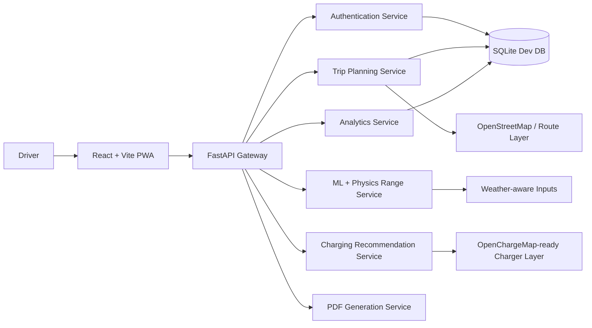
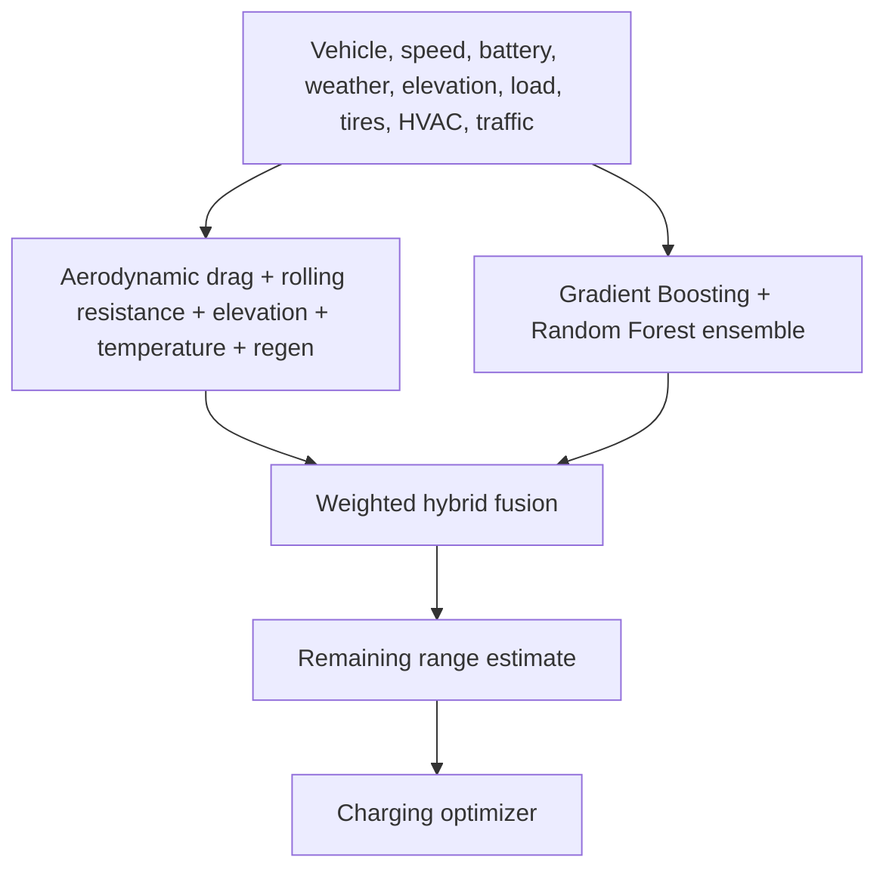
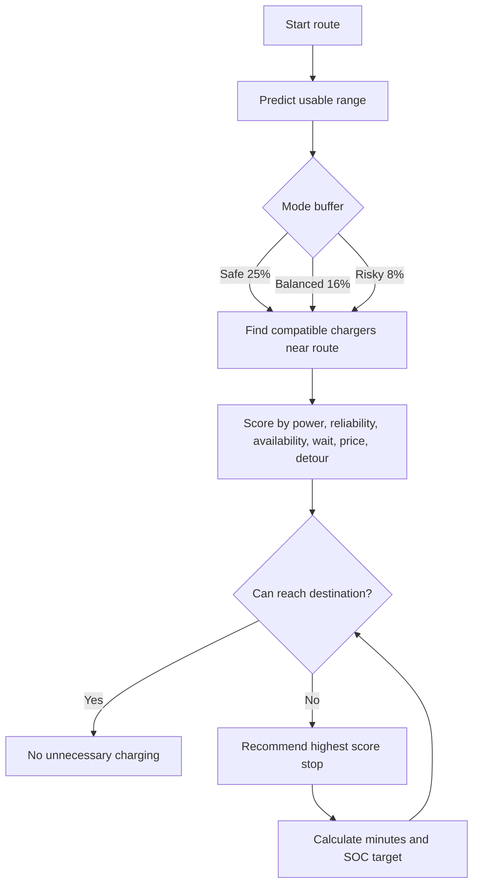

# VoltNav 2.0

AI-powered EV trip planner and charging optimization platform for India.

VoltNav predicts practical EV range, finds chargers across networks, recommends charging only when necessary, compares costs, estimates carbon savings, stores trip history, and generates a PDF itinerary.

## What is included

- Premium responsive React + Vite mobile-first web app.
- FastAPI backend with secure password hashing and signed bearer tokens.
- SQLite persistence for users, vehicles and trip history.
- Hybrid machine-learning + physics-informed range predictor.
- India-focused OpenStreetMap/Leaflet route visualization.
- Realistic multi-network Indian charger data layer with power, connector, reliability, price and availability fields.
- Smart charging-stop optimizer with Safe, Balanced and Risky buffers.
- Charger availability and wait-time estimation.
- Battery health and digital-twin style vehicle profile.
- Analytics dashboard for cost savings, CO₂ reduction, charger mix and energy trend.
- AI charging assistant endpoint with explainable route decisions.
- Downloadable PDF trip report.
- API-key-free fallback mode so the project runs immediately.

## Demo credentials

```text
Email: arjun@voltnav.demo
Password: voltnav123
```

## Quick start

```bash
npm install
python3 -m pip install -r backend/requirements.txt
npm run dev
```

Frontend: `http://localhost:3000`  
Backend API: `http://localhost:8000/api`

## Architecture



## Range prediction model

VoltNav fuses a physics model with a bundled ensemble regressor. The app runs without heavyweight ML packages, and the service can be upgraded to XGBoost/LightGBM behind the same API.



## Charging-stop optimizer



## Backend services

| Service | Purpose |
| --- | --- |
| Authentication | Register, login, signed bearer token validation |
| Range prediction | Hybrid ML + physics remaining-range estimate |
| Trip planning | Route geometry, time, cost, risk, energy consumption |
| Charging recommendation | Compatible station filtering and optimized stop choice |
| Charger discovery | Unified map layer for multi-network EV chargers |
| Vehicle profile | Battery health and digital twin metrics |
| Analytics | Savings, CO₂, charging mix and history summary |
| Assistant | Explainable answers for stop choice, cost and charging target |
| PDF | Trip itinerary export |

## API examples

```bash
curl -X POST http://localhost:8000/api/auth/login \
  -H "Content-Type: application/json" \
  -d '{"email":"arjun@voltnav.demo","password":"voltnav123"}'
```

```bash
curl -X POST http://localhost:8000/api/trips/plan \
  -H "Authorization: Bearer <token>" \
  -H "Content-Type: application/json" \
  -d '{"origin":"Delhi, India","destination":"Manali, Himachal Pradesh","vehicle_model":"Tata Nexon EV Max","battery_percent":80,"driving_mode":"Safe"}'
```

## External API integration points

The project is ready for these providers via environment variables:

```text
OPENCHARGEMAP_API_KEY=
OPENWEATHERMAP_API_KEY=
OPENROUTESERVICE_API_KEY=
```

If keys are absent, VoltNav uses the bundled India city, route and charger layers so demos still work reliably.

## Hackathon MVP vs roadmap

Implemented MVP:

- Smart range prediction.
- Route visualization.
- Charger discovery.
- Charging stop optimization.
- Cost, CO₂ and savings analytics.
- Auth and trip history.
- PDF itinerary.
- Battery health estimator.
- AI charging assistant.

Roadmap:

- Live OpenRouteService route geometry.
- Live OpenChargeMap station ingestion with scheduled refresh.
- OpenWeatherMap and live traffic adjustments.
- LSTM battery degradation model trained on vehicle telemetry.
- Prophet charger-demand forecasting.
- Reinforcement-learning adaptive routing.
- Push notifications and native mobile packaging.
- Fleet operator dashboard with live vehicle telemetry.

## Project structure

```text
voltnav/
  backend/
    app/
      data/india_ev_data.py
      services/energy.py
      services/geo.py
      services/pdf.py
      main.py
  public/
  scripts/dev.mjs
  src/
    components/
    context/
    pages/
    App.jsx
    api.js
    styles.css
```

## Validation

```bash
python3 -m backend.app.tests
npm run build
```

## Notes

This repository is designed for a polished working MVP. It avoids claiming live availability from paid/private networks when API keys are not configured, while still providing functional route planning, charger scoring and PDF generation for demonstrations.
